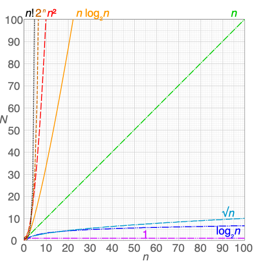

# Algorithms in Java

## Big O Notation

Big O Notation is an efficient way to evaluate algorithm performance. The study of the performance of algorithms - or algorithmic complexity - falls into the field of algorithm analysis. This method calculates the resources (e.g., disk space or time) needed to solve the assigned problem.
Big O notation helps us analyze how the input size affects an algorithm's running time. To understand Big O, it is essential to know the growth rate. This refers to the amount of time needed for each input size.



### Constant Time Algorithms - O(1)

First, let's see a simple algorithm that initializes a variable `n` with the value of 10000 and then prints it:

```java
public void initializeAndPrintVariable() {
  int n = 10000;

  System.out.println(n);
}
```

This code executes in a fixed amount of time regardless of the value of `n`, and the time complexity for the algorithm is `O(1)`. Alternatively, we can print the `n` variable three times using a for loop:

```java
public void initializeAndPrintVariableThreeTimes() {
  int n = 10000;

  for(int i = 0; i < 3; i++) {
    System.out.println(n);
  }
}
```

The example above is also constant time. Even if it takes three times as long to run, it doesn't depend on the input size `n`. Regardless of the input size `n`, it takes three times as long as usual. Therefor, O(2), O(3), or event O(1000) are the same thing as O(1).
We don't care about how long it takes to run, only that it takes constant time.

#### Examples of O(1)

- Accessing an element in an array by its index (e.g., `array[5]`).
- Pushing or popping an element from the end of a dynamic array or the top of a stack.
- Performing a simple arithmetic operation (e.g., `a+b`).

### Logarithmic Time Algorithms - O(log(n))

Asymptotically, constant time algorithms are the quickest. Next comes algorithms that have a logarithmic time complexity. However, they are more challenging to visualize.
One typical example of a logarithmic time algorithm is the binary search algorithm:

```java
public void binarySearch(int[] arr, int x) {
  // INPUT
  // arr: sorted array
  // x: value to search for
  // OUTPUT
  // Index of x in arr, or -1 if not found

  int low = 0;
  int high = arr.length - 1;

  while(low <= high) {
    int mid = (low + high) / 2;
    if(arr[mid] < x) {
      low = mid + 1;
    } else if(arr[mid] > x) {
      high = mid - 1;
    } else {
      return mid;
    }
  }

  return -1;
}
```

In binary search, the input is the array size the algorithm splits in half on each iteration until if finds the target value or -1 if absent. Thus, the running time is proportional to the `log2(n)` function, where `n` is the number of elements in the array. For example, when `n` is 8, the while loop will iterate for `log2(8) = 3` times.
An algorithm has O(log(n)) time complexity if the time it takes to run increases very slow as the input size `n` increases. Specifically, the time increases logarithmically.
The core characteristic of a logarithmic time algorithms is that they typically divide the problem size by a constant fraction (often in half) in each step. They don't need to look at every single element of the input.
If you double the input size `n`, the time taken doesn't diuble. It only increases by a small, constant amount. This makes O(log n) algorithms very efficient for large inputs.

#### Examples of O(log(n))

- Binary search in a sorted array.
- Finding/inserting/deleting in a balanced Binary Search Tree (BST).
- Looking up an item in a hash map (on average, though worst-case can be O(n)).

### Linear Time Algorithms - O(n)

Time complexity is proportional to the size of their inputs. For instance, consider the following pseudocode of an algorithm that enumerates the `n` values, with `n` provided as input:

```java
public void numberCounter(n) {
  for(int i = 1; i < n + 1; i++) {
    System.out.println(i);
  }
}
```

In this example, the number of iterations is directly proportional to the input size `n`. As `n` increases, the time taken to execute the algorithm increases linearly. Therefore the algorithm's time complexity is `O(n)`. When denoting the time complexity, we don't discriminate between 0.1n or (1000n + 1000) as both have O(n) time complexity and grow directly related to the input size.

#### Examples of O(n)

- Iterating through all elements of an array or list once (e.g., finding the maximum value, summing elements).
- Linear search (checking each element one by one).

### N log N Time Algorithms - O(n log n)

The N log N algorithms perform worse than algorithms having linear time complexity. This is because their running time increases linearly and logarithmically with the input size. For example, let's see the following algorithm with for loops:

```java
public void allCombinationsOfTowNumbers(n) {
  // INPUT
  // n: Input value
  // OUTPUT
  // Prints all pairs of numbers from 1 to n
  for(int i = 1; i < n + 1; i++) {
    for (int j = 1; j < log(n); j++) {
      System.out.println(i + ", " + j);
    }
  }
}
```

In this example, the outer loop runs `n` times, and the inner loop runs `log(n)` times. Since the loops are nested, the total number is `n*log(n)`, and we denote the time complexity of the algorithm as `O(n * log(n))`. Another example of an N log N time algorithm is the Quicksort algorithm.

#### Examples of O(n log n)

- Efficient sorting algorithms like Merge Sort, Heap Sort and Quick Sort (average/best case).
- Algorithms involving sorting as a preliminary step followed by linear processing.

### Polynomial Time Algorithms - O(n^m)

It's important to note that compared to N log N algorithms, polynomial algorithms are relatively slower. Within the polynomial algorithms, `O(n^2)` is the most efficient, with `O(n^3)`, `O(n^4)`, and so on being successively slower.

```java
public void allPermutationsOfTwoNumbers(n) {
  // INPUT
  // n = Input value
  // OUTPUT
  // Prints all pairs of numbers from 1 to n

  for(int i = 1; i < n + 1; i++) {
    for(int j = 1; j < n + 1; j++) {
      System.out.println(i + ", " + j);
    }
  }
}
```

In this example, the outer loop runs `n` times while the inner loop runs `n`. Since the loops are nested, the total number of iterations is `n^2`.
Another example of a polynomial time algorithm with a complexity of `O(n^3)` would be the following:

```java
public void allPermutationsOfThreeNumbers(n) {
  // INPUT
  // n = Input value
  // OUTPUT
  // Prints all triplets of numbers from 1 to n

  for(int i = 1; i < n + 1; i++) {
    for(int j = 1; j < n + 1; j++) {
      for(int k = 1; k < n + 1; k++) {
        System.out.println(i + ", " + j + ", " + k);
      }
    }
  }
}
```

Here, the total number of iterations is `n^3`. In this casem, there are three nested loops, each running `n` times. Thus the computational complexity is `O(n^3)`.

### Examples of O(n^m)

- Algorithms with nested loops where each loop iterates `n` times (e.g., comparing every element in a list to every other element).
- Simple sorting algorithms like Bubble Sort, Insertion Sort, and Selection Sort.
- Finding duplicate values in an unsorted list by comparing every pair.

### Exponential Time Algorithms - O(k^n)

Their running time increases significantly as the input size grows. Specifically, the algorith's runtime doubles with each additional input when `k` is 2. For instance, if `n` equals 2, the algorithm will run four times; if `n` equals 3, the algorithm will run eight times. This behavior contrasts logarithmic time algoriyhms, which have a runtime that decreases with each additional input. Additionally, algorithms with complexities of `O(3^n)` triple their runtime with each added input. in general, algorithms with complexities of O(k^n) increase their runtime by a factor of `k` with each additional input.

```java
public void decimalToBinaryEnumerator(n) {
  // INPUT
  // n = Input value
  // OUTPUT
  // Print numbers from 1 to n in the binary format
  for(int i = 1; i < 2^n; i++) {
    System.out.println(i);
  }
}
```

In this example, the for loop runs `2^n`times, printing every binary number from 1 to `2^n`. A typical example of an exponential time algorithm is the Recursive Fibonacci Sequence.

#### Examples of O(k^n)

- Algorithms that try all possible subsets of a set of `n` items (e.g., finding the exact solution to the Travelling Salesperson Problem using brute force).
- Recursive calculation of Fibonacci numbers without memoization.

### Factorial Time Algorithms - O(n!)

This class of algorithms has a runtime that increases proportionally with the factorial of the input size.

```java
public void simulationOfFactorialTime(n) {
  // INPUT
  // n = Integer
  // OUTPUT
  // Prints all numbers from 0 to each factorial of a number n
  for(int i = 0; i < n!; i++) {
    System.out.println(i);
  }
}
```

## Sort

Sorting algorithms are fundamental to computer science, as they provide a way to organize and manage data in a structured manner. From searching for specific items in a dataset to optimizing data processing, sorting is an essential skill for every programmer.

### Key Concepts in Sorting Algorithms

#### Comparison-based sorting vs non-comparison-based sorting

Comparison-based algorithms compare elements of a dataset to determine their order, while non-comparison-based algorithms use other techniques, like counting or radix sort.

#### Stable vs unstable sorting

A stable sorting algorithm maintains the relative order of equal elements in the sorted output, while an unstable algorithm does not guarantee this.

#### In-place vs out-of-place sorting

In-place sorting algorithms sort the data in the original memory location, requiring minimal extra memory. Out-of-place algorithms use additional memory to perform sorting.

#### Time complexity and space complexity

These measures indicate how an algorithm's performance scales with the size of the input data, helping you evalueate its efficiency.

### Popular Sorting Algorithms in Java

#### Bubble Sort

In Bubble Sort, adjacent elements are compared and swapped if they are in the wrong order. This process is repeated until no swaps are needed, indicating that the list is sorted.

```java
public void bubbleSort(int[] arr) {
  int n = arr.length;
  boolean swapped;

  for(int i = 0; i < n - 1) {
    swapped = false;

    for(int j = 0; j < n - 1 - i; j++) {
      if(arr[j] > arr[j+1]) {
        int temp = arr[j];
        arr[j+1] = arr[j];
        arr[j] = temp;
        swapped = true;
      }
    }

    if(!swapped) break;
  }
}
```

#### Selection Sort implementation

In Selection Sort, the algorithm divides the input into a sorted and an unsorted region.
It repeatedly finds the minimum (or maximum) element in the unsorted region and moves it to the end of the sorted region until the entire list is sorted.

```java
// [1, 2, 3, 4, 10]
public void selectionSort(int[] arr) {
  int n = arr.length;

  for(int i = 0; i < n - 1; i++) {
    int minIndex = i;

    for(int j = i + 1; j < n; j++) {
      if(arr[j] < arr[minIndex]) {
        minIndex = j;
      }
    }

    int temp = arr[minIndex];
    arr[minIndex] = arr[i];
    arr[i] = temp;
  }
}
```

#### Insertion Sort implementation

Insertion Sort works by builing the sorted output one item at a time. For each element, the algorithm compares it with the elements in the sorted region, shifting them if they are greater than the current element, and inserts the element in its correct position.

```java
public void insertionSort(int[] arr) {
  int n = arr.length;

  for(int i = 1; i < n; i++) {
    int key = arr[i];
    int j = i - 1;

    while(j >= 0 && arr[j] > key) {
      arr[j + 1] = arr[j];
      j--;
    }

    arr[j + 1] = key;
  }
}
```

#### Quick Sort implementation

Quick sort is a divide-and-conquer algorithm that works by selecting a 'pivot' element from the list and partitioning the other elements into two groups, according to whether they are less than or greater than the pivot. the sub-lists are then sorted recursively. The partition function rearranges the array and returns the pivot index.

```java
public void quickSort(int[] arr, int low, int high) {
  if(low < high) {
    int pivotIndex = partition(arr, low, high);
    quickSort(arr, low, pivotIndex - 1);
    quickSort(arr, pivotIndex + 1, high);
  }
}

public int partition(int[] arr, int low, int high) {
  int pivot = arr[high];
  int i = low - 1;

  for(int j = low; j < high; j++) {
    if(arr[j] < pivot) {
      i++;
      int temp = arr[i];
      arr[i] = arr[j];
      arr[j] = temp;
    }
  }

  int temp = arr[i + 1];
  arr[i + 1] = arr[high];
  arr[high] = temp;
  return i + 1;
}
```

#### Merge Sort implementation

Merge Sort is another divide-and-conquer algorithm that recursively divides the input in two halves, sorts each half, and then merges the sorted halves to produce the final output. The 'merge' function combines two sorted subarrays into a single sorted array.

```java
public void mergeSort(int[], int left, int right) {
  if(left < right) {
    int mid = (left + right) / 2;
    mergeSort(arr, left, mid);
    mergeSort(arr, mid + 1, right);
    merge(arr, left, mid, right);
  }
}

public void merge(int[] arr, int left, int mid, int right) {
  int n1 = mid - left + 1;
  int n2 = right - mid;

  int[] leftArray = new int[n1];
  int[] rightArray = new int[n2];

  for(int i = 0; i < n1; i++) {
    leftArray[i] = arr[left + i];
  }

  for(int i = 0; i < n2; i++) {
    rightArray[i] = arr[mid + 1 + i];
  }

  int i = 0, j = 0, k = left;

  while(i < n1 && j < n2) {
    if(leftArray[i] <= rightArray[j]) {
      arr[k++] = leftArray[i++];
    } else {
      arr[k++] = rightArray[j++];
    }
  }

  while (i < n1) {
    arr[k++] = leftArray[i++];
  }

  while(j < n2) {
    arr[k++] = rightArray[j++];
  }
}
```
