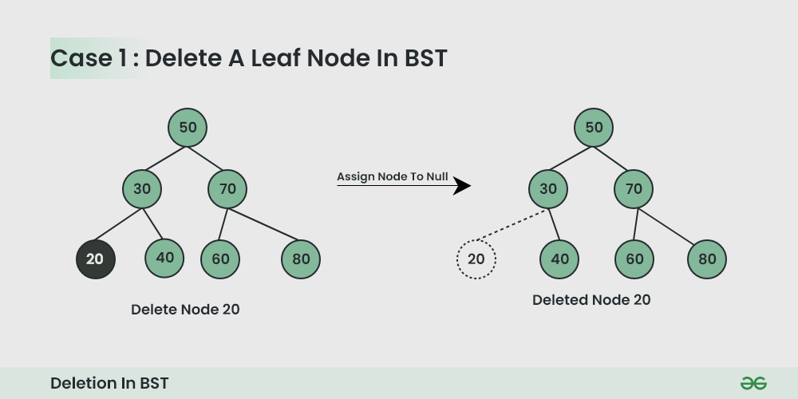
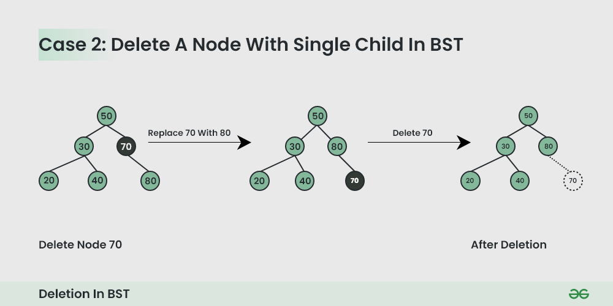
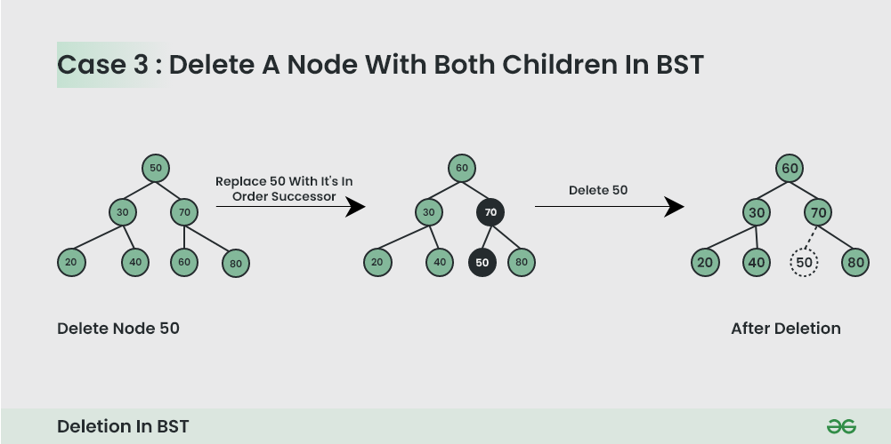

# Java Data Structures

## Basic Data Structures

### Arrays

Arrays are contiguous blocks of memory that store elements of the same data type. They offer constant-time access to elements by index (O(1)). In Java, arrays are fixed in size once created.

```java
int numbers = new int[1];
numbers[0] = 10;

int firstNumber = numbers[0]; // O(1)
```

### ArrayList

Is adynamic array implementation in Java that belongs to the Collections Framework. It can grow or shrink in size as needed, providing flexibility. Accessing elements by index is still O(1) on average.

```java
import java.util.ArrayList;

List<String> names = new ArrayList<>();
names.add("Alice"); // O(1) inserting at the end
names.add(0, "Bob"); // O(n) inserting at front needs to shift elements

String firstPerson = names.get(0); // O(1)
```

### LinkedList

Is another implementation of the `List` interface in Java, using a doubly-linked list structure. It excels at insertions and deletions, especially at the beginning or end of the list (O(1)), but accessing elements by index takes linear time (O(n));

```java
import java.util.LinkedList;

List<Integer> numbersList = new LinkedList<>();
numbersList.addFirst(1); // O(1)
numbersList.addLast(2); // O(1)

int firstElement = numbersList.getFirst(); // O(n)
```

### Stack

Stacks follow the Last-In-First-Out (LIFO) principle. Common operations include `push` (add to the top) and `pop` (remove from the top), both typically taking O(1) time. The `Stack` class is a legacy subclass of `Vector`. Prefer using `Deque` (e.g. `ArrayDeque`) for stack behavior.

```java
import java.util.ArrayDeque;

Deque<String> stack = new ArrayDeque<>();
stack.push("First"); // O(1)
stack.push("Second"); // O(1)

String topElement = stack.pop(); // O(1) Returns "Second"
```

`ArrayDeque` is often faster and more memory-efficient than `LinkedList` for queues or stacks (it uses a circular array).

### Queue

Queues follow the First-In-First-Out (FIFO) principle. Common operations include `enqueue` (add to the rear) and `dequeue` (remove from the front), usually with O(1) time complexity. Java provides the `Queue` interface, with implementations like `LinkedList` and `PriorityQueue`.

```java
import java.util.LinkedList;
import java.util.Queue;

Queue<String> queue = new LinkedList<>();
queue.offer("First"); // O(1)
queue.offer("Second"); // O(1)

String frontElement = queue.poll(); // O(1) Returns "First"
```

A `PriorityQueue` is a data structure that behaves like a queue but orders its elements based on priority, not insertion order.
By default, it's a min-heap, meaning:

- The smallest element (based on natural order or custom comparator) is always at the head.
- Operations like `add`, `poll` and `remove` are all O(log n).
- `peek()` returns the smallest element in O(1) time.

Operations `add/offer` and `poll` take O(log n), while `peek` is O(1).
Use `PriorityQueue` when you need the smalles (or largest, with a reversed comparator) element quickly (e.g., Djikstra's algorithm).

#### There are two ways to define priority

##### 1. Using `Comparable` (natural order)

Your class must implement `Comparable<T>` and override the `compareTo` method.

Ordering integers naturally (smallest first is default):

```java
import java.util.PriorityQueue;

PriorityQueue<Integer> pq = new PriorityQueue<>();
pq.add(5); // O(log n)
pq.add(2);

int min = pq.poll(); // O(log n) returns 2
```

For a custom class:

```java
class Task implements Comparable<Task> {
  int priority;

  public Task(int priority) {
    this.priority = priority;
  }

  @Override
  public int compareTo(Task other) {
    return Integer.compare(this.priority, other.priority);
  }
}

PriorityQueue<Task> pq = new PriorityQueue<>();

pq.add(new Task(10));
pq.add(new Task(5));

System.out.println(pq.poll().priority); // 5 - lowest priority first
```

##### 2. Using `Comparator` (custom order without modifying the class)

You can pass a custom `Comparator` to the constructor if:

- The class does not implement `Comparable`.
- You want a different priority rule.

Highest number first (max-heap behavior):

```java
PriorityQueue<Integer> maxHeap = new PriorityQueue<>(Comparator.reverseOrder());

maxheap.add(5);
maxHeap.add(1);
maxHeap.add(3);

System.out.println(maxHeap.poll()); // 5 (largest first)
```

Custom class with `Comparator`:

```java
class Task {
  int priority;
  String name;

  public Task(int priority, String name) {
    this.priority = priority;
    this.name = name;
  }
}

PriorityQueue<Task> pq = new PriorityQueue<>(Comparator.comparingInt(t -> t.priority));

pq.add(new Task(10, "Low"));
pq.add(new Task(1, "High"));

System.out.println(pq.poll().name); // "High"
```

You can also sort descending like this:

```java
PriorityQueue<Task> pq = new PriorityQueue<>(
  Comparator.comparingInt((Task t) -> t.priority).reversed()
);
```

### HashMap

Is a hash table implementation in Java that stores key-value pairs. It provides average O(1) time complexity for basic operations like `put` (insert), `get` (retrieve), and `remove` (delete), assuming a good hash function.

```java
import java.util.HashMap;

Map<String, Integer> ages = new HashMap<>();

ages.put("Alice", 30); // O(1) average

int aliceAge = ages.get("Alice"); // O(1) average, returns 30
```

HashMap uses an array of `Node` objects (or `Entry` in older Java versions). Each `Node` is represented as a class that contains 4 fields:

1. int hash
2. K key
3. V value
4. Node next

The performance of HashMap depends on 2 parameters which are named as follows:

1. **Initial Capacity** - It is the capacuty of HashMap at the time of its creation (It is the number of buckets a HashMap can hold when the HashMap is instantiated). In Java, it is 2^4 = 16 initially, meaning it can hold 16 key-value pairs.
2. **Load Factor** - It is the percent value of the capacity after which the capacity of HashMap is to be increased (It is the percentage fill of buckets after which Rehashing takes place). In Java, it is 0,75f by default, meaning the rehashing takes place after filling 75% of the capacity.
3. **Threshold** - It is the product of Load Factor and Initial Capacity. In Java, by default, it is (16\*0,75 = 12). That is, Rehashing takes place after inserting 12 key-value pairs into the HashMap.
4. **Rehashing** - It is the process of doubling the capacity of the HashMap after it reaches its Threshold. In Java, HashMap continues to rehash (by default) in the following sequence - 2^4, 2^5, 2^6, 2^7,... so on.

If the initial capacity is kept higher then rehashing will never be done. But by keeping it higher increases the time complexity of iteration. So it should be chosen very cleverly to increase the performance. The expected number of values should be taken into account to set the initial capacity. The most generally preferred load factor is 0.75 which provides a good deal between time and space costs. The load factor's value varies between 0 and 1.

**Note:** From Java 8 onward, Java has started using Self Balancing BST instead of a linked list for chaining. The advantage of self-balancing bst is, we get the worst case (when every key maps to the same slot) search time is O(Log n).

**Advantages of HashMap**:

- **Fast retrieval**: HashMaps provide constant time access to elements, which means that retrieval and insertion of elements is very fast.
- **Efficient storage**: HashMaps use a hashing function to map keys into indices in an array. This allows for quick lookup of values based on keys, and efficient storage of data.
- **Flexibility**: HashMaps allow for null keys and values, and can store key-value pairs of any data type.
- **Easy to use**: HashMaps have a simple interface and can be easily implemented in Java.
- **Suitable for large data sets**: HashMaps can handle large data sets without slowing down.

**Disadvantages of HashMap**:

- **Unordered**: HashMaps are not ordered, which means that the order in which elements are added to the map is not preserved.
- **Not thread-safe**: HashMaps are not thread-safe, which means that if multiple threads access the same hashmap simultaneously, it can lead to data inconsistencies.
- **Performance can degrade**: In some cases, if the hashing function is not properly implemented or if the load factor is too high, the performance of a HashMap can degrade.
- **Higher memory usage**: Since HashMaps use an underlying array, they can use more memory than other data structures like arrarys or lists. This can be a disadvantage if memory usage is a concern.

### HashSet

Is backed by a `HashMap`. Operations (`add`, `contains`, `remove`) are O(1) average (same caveats as `HashMap`). It forbids duplicate entries.

```java
Set<String> hashSet = new HashSet<>();

hashSet.add("hello"); // O(1) average

boolean exists = hashSet.contains("hello"); // O(1) average
```

## Trees

### Binary Tree

A binary tree is a specific type of tree data structure where each node is constrained to have at most two children, which are typically designated as the left child and right child. This restriction to a maximum of two children per node is the defining feature of binary trees, setting them apart from other tree structures that can allow a greater number of children. This fundamental constraint simplifies both the implementation and analysis of operations performed on binary trees, making them a widely used foundation for more complex tree-based structures.

Binary trees possess several fundamental properties. They exhibit a hierarchical structure, originating from a single root node. Nodes that do not have any children are termed **leaf nodes**. The tree is organized into levels, with the root at level 0, its children at level 1, and so forth, based on their distance from the root. Each node in a binary tree can also be considered as the root of its own **subtree**. There are different categories of binary trees based on their structural characteristics, including **full binary trees** (where every node other than the leaves has two children), **complete binary trees** (where all levels are completely filled except possibly the last level, which is filled from left to right), and **perfect binary trees** (where all internal nodes have exactly two children and all leaf ndoes are at the same level). Understanding these properties and types is essential as they dictate the suitability of binary trees for various applications and algorithms. For instance, complete binary trees are the foundational tree structure for heaps, a type of priority queue.

In Java, a binary tree is typically implemented using a class to represent a node. A basic **node structure**, often named `TreeNode`, will contain an attribute to store the node's data, commonly referred to as `value` or `data`, and two references to other `TreeNode` objects: `left` for the left child and `right` for the right child. These `left` and `right` references can either point to another `TreeNode` object, representing a child node, or be `null`, indicating the absence of a child in that position. This node structure serves as the fundamental building block for constructing and manipulating binary trees in Java.

The **insertion operation** in a general binary tree involves adding a new node at a specific location, often as a left or right child of an existing node. The precise process depends on the specific requirements or the type of binary tree being implemented. For example, in a Binary Search Tree (BST), the insertion follows a specific ordering rule based on the value of the new node compared to the existing nodes in the tree. The following Java code snippet illustrates a basic insertion into a binary tree, assuming a specific parent node and child position are known:

#### Create/Declare a Node of a Binary Tree

```java
class Node {
  int data;
  Node left, right;

  Node(int d) {
    this.data = d;
    this.left = null;
    this.right = null;
  }
}

class Main {
  public static void main(String[] args) {
    // Initialize and allocate memory for tree nodes
    Node firstNode = new Node(2);
    Node sedondNode = new Node(3);
    Node thirdNode = new Node(4);
    Node fourthNode = new Node(5);

    // Connect binary tree nodes
    firstNode.left = secondNode;
    firstNode.right = thirdNode;
    secondNode.left = fourthNode;
  }
}
```

#### Terminologies in Binary Tree

- Nodes: The fundamental part of a binary tree, where each node contains data and link to two childs nodes.
- Root: The topmost node in a tree is known as the root node. It has no parent and serves as the starting point for all nodes in the tree.
- Parent Node: A node that has one or more child nodes. In a binary tree, each node can have at most two children.
- Child Node: A node that is descendant of another node (its parent).
- Leaf Node: A node that does not have any children or both children are null.
- Internal Node: A node that has at least one child. This includes all nodes except the leaf nodes.
- Depth of a Node: The number of edges from a specific node to the root node. The depth of the root node is zero.
- Height of a Binary Tree: The number of nodes from the deepest leaf node to the root node.

#### Properties of Binary Tree

- The maximum number of nodes at level L of a binary tree is 2^L.
- The maximum number of nodes in a binary tree of height H is 2^H - 1.
- Total number of leaf nodes in a binary tree = total number of nodes with 2 children + 1.
- In a Binary Tree with N nodes, the minimum possible height or the minimum number of levels is Log2(N+1).
- A Binary Tree with L levels has at least |Log2L| + 1 levels.

#### Operations in Binary Tree

##### 1. Traversal in Binary Tree

Traversal in Binary Tree involves visiting all nodes of the binary tree. Tree Traversal algorithms can be classified broadly into two categories, **DFS** and **BFS**.

**Depth-First Search (DFS) algorithms:** explores as far down a branch as possible before backtracking. It is implemented using recursion. The main traversal methods in DFS for binary trees are:

- Preorder Traversal (current-left-right): Visits the node first, then left subtree, then right subtree.
- Inorder Traversal (left-current-right): Visits left subtree, then the node, then the right subtree.
- Postorder Traversal (left-right-current): Visits left subtree, then right subtree, then the node.

**Breadth-First Search (BFS) algorithms:** BFS explores all nodes at the present depth before moving on to nodes at the next depth level. it is typically implemented using a queue. BFS in a binary tree is commonly referred to as Level Order Traversal.

```java
import java.util.LinkedList;
import java.util.Queue;

class Node {
  int data;
  Node left;
  Node right;

  Node(int d) {
    this.data = d;
    this.left = null;
    this.right = null;
  }
}

class Main {
  // Pre-order DFS: Root, Left, Right
  static void preOrderDFS(Node node) {
    if(node == null) return;
    System.out.println(node.data + " ");
    preOrderDFS(node.left);
    preOrderDFS(node.right);

    // Result: 2 3 5 4
  }

  // In-order DFS: Left, Root, Right
  static void inOrderDFS(Node node) {
    if(node == null) return;
    inOrderDFS(node.left);
    System.out.println(node.data + " ");
    inOrderDFS(node.right);

    // Result: 5 3 2 4
  }

  // Post-order DFS: Left, Right, Root
  static void postOrderDFS(Node node) {
    if(node == null) return;
    postOrderDFS(node.left);
    postOrderDFS(node.right);
    System.out.println(node.data + " ");

    // Result: 5 3 4 2
  }

  // BFS: Level order traversal
  static void BFS(Node root) {
    if(root == null) return;
    Queue<Node> queue = new LinkedList<>();
    queue.add(root);

    while(!queue.isEmpty()) {
      Node node = queue.poll();
      System.out.println(node.data + " ");
      if(node.left != null) queue.add(node.left);
      if(node.right != null) queue.add(node.right);
    }

    // Result: 2 3 4 5
  }

  public static void main(String[] args) {
    // Creating the tree
    Node root = new Node(2);
    root.left = new Node(3);
    root.right = new Node(4);
    root.left.left = new Node(5);
  }
}

```

##### 2. Insertion in Binary Tree

Inserting elements means add a new node into the binary tree. As we know that there is no such ordering of elements in the binary tree, So we do not have to worry about the ordering of node in the binary tree. We would first create a root node in case of empty tree. Then subsequent insertions involve iteratively searching for an empty place at each level of the tree. When an empty left or right child is found, then a new node is inserted there. By convention, insertion always starts with the left child node.

```java
class Main {
  // Function to insert a new node in the binary tree
  static Node insert(Node root, int key) {
    if(root == null) return new Node(key);

    // Create a queue for level order traversal
    Queue<Node> q = new LinkedList<>();
    q.add(root);

    while(!q.isEmpty()) {
      Node temp = q.poll();

      // If left child is empty, insert the new node here
      if(temp.left == null) {
        temp.left = new Node(key);
        break;
      } else {
        q.add(temp.left);
      }

      // If right child is empty, insert the new node here
      if(temp.right == null) {
        temp.right = new Node(key);
        break;
      } else {
        q.add(temp.right);
      }
    }

    return root;
  }
}
```

##### 3. Searching in Binary Tree

Searching for a value in binary tree means looking through the tree to find a node that has that value. Since binary trees do not have a specific order like binary search trees, we typically use any traversal method to search. The most common method are **depth-first search (DFS)** and **breadth-first search (BFS)**. In **DFS**, we start from the root and explore the depth nodes first. In BFS, we explore all the nodes at the present depth level before moving on to the nodes at the next level. We continue this process until we either find the node with the desired value or reach the end of the tree. If the tree is empty or the value isn't found after exploring all possibilities, we conclude that the value does not exist in the tree.

Search in a binary tree using Depth-First Search (DFS):

```java
// Function to search for a value in the binary tree
// using DFS
static boolean searchDFS(Node root, int value) {
  // Base case: If the tree is empty or we've reached a leaf node
  if(root == null) return false;

  // if the node's data is equal to the value we are searching for
  if(root.data == value) return true;

  // Recursively search in the left and right subtrees
  boolean left_res = searchDFS(root.left, value);
  boolean right_res = searchDFS(root.right, value);

  return left_res || right_res;
}
```

##### 4. Deletion in Binary Tree

Deleting a node from a binary tree means removing a specific node while keeping the tree's structure. First, we need to find the root node that we want to delete by traversing through the tree using any traversal method. Then replace the node's value with the value of the last node in the tree (found by traversing to the rightmost leaf), and then delete that last node. This way, the tree structure won't be affected. And remember to check for special cases, like trying to delete from an empty tree to avoid any issues.

```java
// Function to delete a node from the binary tree
static Node deleteNode(Node root, int val) {
  if(root == null) return null;

  // Use a queue to perform BFS
  Queue<Node> q = new LinkedList<>();
  q.add(root);
  Node target = null;

  // Find the target node
  while(!q.isEmpty()) {
    Node curr = q.poll();

    if(curr.data == val) {
      target = curr;
      break;
    }
    if(curr.left != null) q.add(curr.left);
    if(curr.right != null) q.add(curr.right);
  }

  if(target == null) return root;

  // Find the deepest rightmost node and its parent
  Node lastNode = null;
  Node lastParent = null;
  Queue<Node> q1 = new LinkedList<>();
  Queue<Node> parentQueue = new LinkedList<>();

  q1.add(root);
  parentQueue.add(null);

  while(!q1.isEmpty()) {
    Node curr = q1.poll();
    Node parent = parentQueue.poll();

    lastNode = curr;
    lastParent = parent;

    if(curr.left != null) {
      q1.add(curr.left);
      parentQueue.add(curr);
    }

    if(curr.right != null) {
      q1.add(curr.right);
      parentQueue.add(curr);
    }
  }

  // Replace target's value with the last node's value
  target.data = lastNode.data;

  // Remove the last node
  if(lastParent != null) {
    if(lastParent.left == lastNode) lastParent.left = null;
    else lastParent.right = null;
  } else {
    return null;
  }

  return root;
}
```

### Binary Search Tree (BST)

Binary Search tree is a data structure used in computer science for organizing and storing data in a sorted manner. Binary search tree follows all properties of binary tree and for every nodes, its left subtree contains values smaller than the node, and the right subtree contains values greater than the node. This hierarchical structure allows for efficient Searching, Insertion, and Deletion operations on the data stored in the tree.

#### Properties of Binary Search Tree

- The left subtree of a node contains only nodes with keys smaller than the node's key.
- The right subtree of a node contains only nodes with keys greater than the node's key.
- The left and right subtree each must also be a binary search tree.
- There must be no duplicate nodes (BST may have duplicate values with different handling apporaches).

#### Operations in Binary Search Tree

##### 1. Insertion in Binary Search Tree

A new key is always inserted at the leaf by maintaining the property of the binary search tree. We start searching for a key from the root until we hit a leaf node. Once a leaf node is found, the new node is added as a child of the leaf node. The below steps are followed while we try to insert a node into a binary search tree:

- Initialize the current node with root node.
- Compare the key with the current node.
- Move left if the key is smaller than or equal to the current node value.
- Move right if the key is greater than current node value.
- Repeat steps 2 and 3 until you reach a leaf node.
- Attach the new key as a left or right child based on the comparison with the leaf node's value.

Recursive:

```java
class Node {
    int key;
    Node left, right;
    public Node(int item)
    {
        key = item;
        left = right = null;
    }
}

class Main {
  // A utility function to insert a new node with the given key
  static Node insert(Node root, int key) {

    // If the tree is empty, return a new node
    if(root == null) return new Node(key);

    // If the key is already present in the tree, return the node
    if(root.key == key) return root;

    // Otherwise, recur down the tree
    if(key < root.key) {
      root.left = insert(root.left, key);
    } else {
      root.right = insert(root.right, key);
    }

    // Return the (unchanged) node pointer
    return root;
  }

  public static void main(String[] args)
  {
      Node root = null;

      // Creating the following BST
      //      50
      //     /  \
      //    30   70
      //   / \   / \
      //  20 40 60 80

      root = insert(root, 50);
      root = insert(root, 30);
      root = insert(root, 20);
      root = insert(root, 40);
      root = insert(root, 70);
      root = insert(root, 60);
      root = insert(root, 80);
  }
}
```

##### 2. Search In Binary Search Tree

Let's say we want to search for the number X, we start at the root. Then:

- We compare the value to be searched with the value of the root.
  - If it's equal we are done with the search if it's smaller we know that we need to go to the left subtree because in a binary search tree all the elements in the left subtree are smaller and all the elements in the right subtree are larger.
- Repeat the above step till no more traversal is possible.
- If at any iteration, key is found, return True, else False.

Recursive:

```java
// Function to search a key in BST
static Node search(Node root, int key) {
  // Base Cases: root is null or key is present at root
  if(root == null || root.key == key) return root;

  // Key is greater than root's key
  if(root.key < key) return search(root.right, key);

  // Key is smaller than root's key
  return search(root.left, key);
}
```

##### 3. Delete in Binary Search Tree

###### 1. Delete a Leaf Node in BST



###### 2. Delete a Node with Single Child in BST

Deleting a single child node is also simple in BST. Copy the child to the node and delete the node.



###### 3. Delete a Node with Both Children in BST

Deleting a node with both children is not so simple. Here we have to delete the node in such a way, that the resulting tree follows the properties of a BST.

The trick is to find the inorder successor of the node. Copy contents of the inorder successor to the node, and delete the inorder successor.



**Note:** Inorder successor is needed only when the right child is not empty. In this particular case, the inorder successor can be obtained by finding the minimum value in the right child of the node.

Recursive deletion in a BST:

```java
// This function deletes a given key x from the
// given BST and returns the modified root of
// the BST (if it is modified)
static Node delNode(Node root, int x) {

  // Base case
  if(root == null) return root;

  // If key to be searched is in a subtree
  if(root.key > x) {
    root.left = delNode(root.left, x);
  } else if(root.key < x) {
    root.right = delNode(root.right, x);
  } else {
    // If root matches with the given key

    // Cases when root has 0 children or
    // only right child
    if(root.left == null) {
      return root.right;
    }

    // When root has only left child
    if(root.right == null) {
      return root.left;
    }

    // When both children are present
    Noce succ = getSuccessor(root);
    root.key = succ.key;
    root.right = delNode(root.right, succ.key);
  }

  return root;
}

// Note that is is not a generic inorder successor
// function. It mainly works when the right child
// is not empty, which is the case we need in BST
// delete.
static Node getSuccessor(Node curr) {
  curr = curr.right;
  while(curr != null && curr.left != null) {
    curr = curr.left;
  }

  return curr;
}
```
