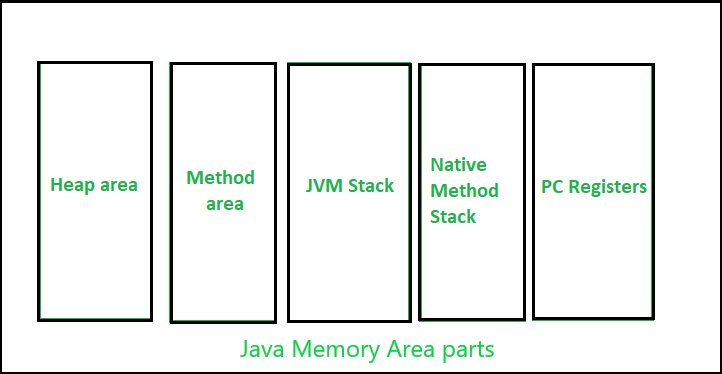

# Java

## Key Concepts

### Encapsulation

Is the mechanism of building data (attributes) and the methods that operate on that data into a single unit, often a class. This concept also involves data hiding, where the internal state of an object is protected from unauthorized access and modification from outside the object. In Java, encapsulation is achieved by declaring instance variables as private and providing public getter and setter methods to control access to these variables. This ensures that the internal implementation details are shielded, and data can only be accessed or modified through well-defined interfaces, promoting data intregrity and maintainability.

### Inheritance

Is a powerful mechanism that allows a class (subclass or child class) to inherit the properties (attributes and methods) of another class (superclass or parent class). This fosters code reusability, as common functionalities can be defined in a superclass and then extended by multiple subclasses, avoiding code duplication and adhering to the DRY (Don't Repeat Yourself) principle. Inheritance also establishes an "is-a" relationship between classes, where a sublaclass is a specialized type of its superclass. In Java, the `extends` keyword is used to implement inheritance. Sublasses can also add their own unique fields and methods, or override the methods inherited from the superclass to provide specific implementations.

### Polymorphism

Means "meany forms", is the ability of an object to take on many forms. In Java, polymorphism is primarily achieved through method overloading and method overriding. **Method overloading** (compile-time polymorphism) occurs when multiple methods in the same class have the same name but different parameter lists (different number, order, or types of parameters). The compiler determines which method to call based on the arguments passed during the method invocation. **Method overriding** (run-time polymorphism) happens when a subclass must have the same name, return type, and parameter list as the method in the superclass. The decision of which method to execute is made at runtime based on the actual type of the object.

### Abstraction

Is the process of hiding complex implementation details and showing only the essential information to the user. It allows developers to focus on what an object does rather than how it achieves it, by ignoring irrelevant details. In Java, abstraction is achieved through abstract classes and interfaces. Abstract classes can have abstract methods (methods without implementation) as well as concrete methods (methods with implementation). They cannot be instantiated directly but must be subclassed, and the subclasses typically provide implementations for the abstract methods. Interfaces, on the other hand, define a contract of methods that implementing classes must adhere to. Before Java 8, interfaces could only contain abstract methods and constants, providing 100% abstraction. However, with the introduction of default and static methods in Java 8 and private methods in Java 9, interfaces can now provide some level of implementation.

### Classes

Serve as blueprints or templates for creating objects. A class defines the attributes (data members or fields) and behaviors (methods) that will be shared by all objects of that class. A class declaration includes modifiers, the class name, and the class body containing fields and methods.

### Objects

Are instances of classes. They are fundamental building blocks of OOP, representing specific entities with their own unique state (values of attributes) and the ability to perform the behaviors defined by their class. Objects interact with each other by sending and receiving messages, typically through method invocations.

### Methods

Are blocks of code that perform specific tasks. They allow for organizing code into reusable units and can have parameters (input values) and return a value. Methods are defined within classes and encapsulate the behavior of the objects of that class.

### Access Modifiers

Control the visibility and accessibility of classes, interfaces, variables, methods, and constructors. Java provides four access mofifiers: `public`, `protected`, `private`, and the default (package-private). `public` members are accessible from anywhere, `private` members are accessible only within the same class, `protected` members are accessible within the same package and by subclasses, and package-private members are accessible within the same package. Choosing the appropriate access modifier is crucial for encapsulation and controlling the scope of class members.

## Advanced Java OOP Features

Beyond fundamental pillars, Java offers advanced features that enhance its capabilities for object-oriented design and development. These include interfaces, abstract classes, generics and lambda expressions.

### Interfaces

In Java, they are a contract that specifies a set of methods that a class must implement. They define a type by specifying the behavior that implementing classes should provide. A class can implement multiple interfaces, allowing it to adopt multiple behaviors or roles. Interfaces promote loose coupling by defining a contract that implementing classes adhere to, without specifying the implementation details. Java 8 introduced default methods in interfaces, which provide a default implementation for a method, and static methods, which can be called directly on the interface. Java 9 further added private methods to interfaces, which can be used to share code between other methods within the interface.

### Abstract Classes

Are classes that cannot be instantiated directly and may contain abstract methods (declared without implementation) or concrete methods (with implementation). They serve as a base class for subclasses, providing a common structure and potentially some shared implementation. Subclasses of an abstract class must either implement all the abstract methods of their superclass or be declared abstract themselves. Abstract classes can also contain non-static and non-final fields, as well as constructors. The choice between using an abstract class and an interface often depends on whether there is a need for shared implementation or just a contract of behavior.

### Generics

Were introduced in Java 5 to provide compile-time type safety and enhance code reusability. Generics allow types (classes, interfaces, methods) to be parameterized by type. This means that you can define a class or method that can work with different types of objects while ensuring type safety at compile time, reducing the risk of `ClassCastException` at runtime. For example, you can create a `List` that specifically holds `String` objects (`List<String>`), and the compiler will prevent you from adding other types of objects to it. Generics are widely used in Java's Collections Framework.

### Lambda Expressions

Introduced in Java 8, provide a concise way to represent anonymous functions or methods. They enable treating functionality as a method argument or code as data, facilitating functional programming paradigms within Java's obect-oriented context. Lambda expressions are particularly useful for implementing functional interfaces (interfaces with a single abstract mehtod) in a more readable and compact manner. They are often used with Java Strams API for concise and expressing data processing.

## SOLID Principles of OOP

### S - Single Responsibility Principle (SRP)

Every class should have a single responsibility.
A class should have only one reason to change, meaning it should have only one job or responsibility. This principle promotes high cohesion and reduces coupling, making the code easier to understand, test, and maintain. For example, instead of having a single `Vehicle` class that handles printing details, calculating value, and adding to a database, these responsibilities should be separated into distinct classes like `VehiclePrinter`, `VehicleValueCalculator`, and `VehicleRepository`.

### O - Open Closed Principle (OCP)

software entities (classes, modules, functions) should be open for extension but closed for modification. This means that new functionality should be added by extending existing code rather than modifying it. For instance, if you have a `Shape` class with subclasses like `Rectangle` and `Circle`, adding a new shape like `Triangle` should involve creating a new `Triangle` class that extends `Shape`, without altering the existing `Rectangle` or `Circle` classes. This can often be achieved using interfaces and abstract classes.

#### Example

```Java
class Footballer {
    private String name;
    private int age;
    private String role;

    public Footballer(String name, int age, String role) {
        this.name = name;
        this.age = age;
        this.role = role;
    }

    public void getFootballerRole() {
        switch (role.toLowerCase()) {
            case "goalkeeper":
                System.out.println("The footballer, " + name + " is a goalkeeper");
                break;
            case "defender":
                System.out.println("The footballer, " + name + " is a defender");
                break;
            case "midfielder":
                System.out.println("The footballer, " + name + " is a midfielder");
                break;
            case "forward":
                System.out.println("The footballer, " + name + " plays in the forward line");
                break;
            default:
                throw new IllegalArgumentException("Unsupported role: " + role);
        }
    }

    public static void main(String[] args) {
        Footballer player1 = new Footballer("Cristiano Ronaldo", 39, "forward");
        Footballer player2 = new Footballer("Virgil van Dijk", 32, "defender");

        player1.getFootballerRole(); // Output: The footballer, Cristiano Ronaldo plays in the forward line
        player2.getFootballerRole(); // Output: The footballer, Virgil van Dijk is a defender
    }
}
```

The class above violates the Open Closed Principle as there might be more roles to add on the class. The class is not closed for modification.

Instead, the code below should be implemented:

```Java
// Abstract class PlayerRole
abstract class PlayerRole {
    // Abstract method that must be implemented by subclasses
    public abstract String getRole();
}

// Subclasses implementing the abstract method
class GoalkeeperRole extends PlayerRole {
    @Override
    public String getRole() {
        return "goalkeeper";
    }
}

class DefenderRole extends PlayerRole {
    @Override
    public String getRole() {
        return "defender";
    }
}

class MidfieldRole extends PlayerRole {
    @Override
    public String getRole() {
        return "midfielder";
    }
}

class ForwardRole extends PlayerRole {
    @Override
    public String getRole() {
        return "forward";
    }
}

// Footballer class that depends on PlayerRole
class Footballer {
    private String name;
    private int age;
    private PlayerRole role;

    public Footballer(String name, int age, PlayerRole role) {
        this.name = name;
        this.age = age;
        this.role = role;
    }

    public String getRole() {
        return role.getRole();
    }
}

Footballer player1 = new Footballer("Cristiano Ronaldo", 30, new ForwardRole());
Footballer player2 = new Footballer("Virgil van Dijk", 32, new DefenderRole());
```

Now, if a player can have multiple roles, we should use interfaces, as Java allows to implement multiple interfaces but only extend 1 class.
In that case, the code below should be implemented:

```Java
interface PlayerRole {
    String getRole();
}

class GoalkeeperRole implements PlayerRole {
    public String getRole() {
        return "goalkeeper";
    }
}

class DefenderRole implements PlayerRole {
    public String getRole() {
        return "defender";
    }
}

class MidfieldRole implements PlayerRole {
    public String getRole() {
        return "midfielder";
    }
}

class ForwardRole implements PlayerRole {
    public String getRole() {
        return "forward";
    }
}

class Footballer {
    private String name;
    private int age;
    private List<PlayerRole> roles; // A player can have multiple roles

    public Footballer(String name, int age, List<PlayerRole> roles) {
        this.name = name;
        this.age = age;
        this.roles = roles;
    }

    public List<String> getRoles() {
        return roles.stream()
                    .map(PlayerRole::getRole)
                    .toList(); // Collects role names
    }

    public void addRole(PlayerRole role) {
        roles.add(role);
    }
}

List<PlayerRole> roles = new ArrayList<>();
        roles.add(new ForwardRole());
        roles.add(new MidfieldRole());

Footballer player = new Footballer("Cristiano Ronaldo", 39, roles);
```

### L - Liskov Substitution Principle (LSP)

Subtypes should be substitutable for their base types without altering the correctness of the program. If a class `B` is a subclass of class `A`, then any instance of `A` can be replaced by an instance of `B` without the program behaving incorrectly. A classic example of a violation is a `Square` class inheriting from a `Rectangle` class if the `Rectangle` has independent setters for width and height, as this would violate the fundamental property of a square where all sides are equal.
Instead, a shape interface/abstract class should be created with a getArea method.
This way, Square and Rectangle can implement/extend Shape and override the area implementation.

### I - Interface Segregation Principle (ISP)

Clients should not be forced to depend upon interfaces that they do not use. It's better to have multiple smaller, client-specific interfaces than one large, general-purpose interface. For example, if you have an `OfficePrinter` interface with methods for printing, scanning, and faxing, a simple printer that only prints should not be forced to implement the scanning and faxing methods. Instead, you could have separate `Printer`, `Scanner`, and `Fax` interfaces.

Ex. Interface worker with work(), eat() and sleep() methods should not be implemented
by both HumanWorker and RobotWorker.
Instead create 3 interfaces Workable, Eatable and Sleepable. HumanWorker will implement all,
but RobotWorker will only implement the Workable interface

### D - Dependency Inversion Principle (DIP)

High-level modules should not depend on low-level modules. Both should depend on abstractions. Abstractions should not depend on details. Details should depend on abstractions. This principle promotes loose coupling by making modules depend on interfaces or abstract classes rather than concrete implementations. For instance, a `UserService` should not directly depend on a concrete `DatabaseUserRepository` but rather on an abstract `UserRepository` interface. Different database implementations can then implement this interface, and the `UserService` can work with any of them without modification.

Ex. Bad Example (Violation of DIP):

```Java
class EmailSender {
    public void sendEmail(String message) {
        System.out.println("Sending Email: " + message);
    }
}

class NotificationService {
    private EmailSender emailSender;

    public NotificationService() {
        this.emailSender = new EmailSender(); // ❌ DIRECT dependency on EmailSender
    }

    public void notifyUser(String message) {
        emailSender.sendEmail(message);
    }
}
```

NotificationService (high-level module) depends directly on EmailSender (low-level module).
If we want to send SMS or Push notifications, we must modify NotificationService, breaking the Open/Closed Principle.
Hard to test because EmailSender is hardcoded.

Instead of hardcoding EmailSender, we introduce an abstraction (Notifier).

```Java
interface Notifier {
    void send(String message);
}

class EmailNotifier implements Notifier {
    @Override
    public void send(String message) {
        System.out.println("Sending Email: " + message);
    }
}

class SMSNotifier implements Notifier {
    @Override
    public void send(String message) {
        System.out.println("Sending SMS: " + message);
    }
}

class PushNotifier implements Notifier {
    @Override
    public void send(String message) {
        System.out.println("Sending Push Notification: " + message);
    }
}

class NotificationService {
    private Notifier notifier; // ✅ DEPENDS ON ABSTRACTION

    public NotificationService(Notifier notifier) {
        this.notifier = notifier;
    }

    public void notifyUser(String message) {
        notifier.send(message);
    }
}
```

- Each NotificationService is responsible for only one notification type → Clean separation of concerns.
- More flexibility → The controller chooses which notification(s) to send.
- Follows DIP → NotificationService still depends on abstractions (Notifier).
- Easier Testing → We can test emailNotificationService, smsNotificationService, or pushNotificationService separately.

### Interfaces vs Abstract Classes

Interface:

- You only need methods (You can also have default method implementations).
- You want multiple inheritance.
- You want to keep it flexible.
- Not meant for static methods.
- Grants flexibility as we can create another implementation of the interface without modifying the old one.

Abstract Class:
All classes share fields or constructors.
You want default behavior and state together.

## Testing Methodologies

Testing is a critical aspect of software development, ensuring the correctness and reliability of object-oriented applications. Several methodologies are applicable to Java OOP.

### Unit Testing

Focuses on testing individual units of code, such as methods or classes, in isolation. The goal is to verify that each unit functions correctly on its own. JUnit and TestNG are popular testing frameworks in Java that provide annotations and APIs for writing and running unit tests. Examples of unit tests would involve creating test cases for specific methods of a class, providing different inputs, and asserting that the output matches the expected results. Mocking frameworks like Mockito are often used in unit testing to create test doubles (mocks) of dependencies, allowing the unit under test to be isolated from its collaborators.

### Integration Testing

Involves testing the interaction between different units or components of the application. This type of testing ensures that the various parts of the system work together correctly. Strategies for integration testing in Java OOP include testing the interactions between different classes, modules, and external systems such as databases or APIs. For example, you might test the interaction between a service class and its data access object to ensure that data os correctly retrieved and persisted.

### Smoke Testing

Is a preliminary testing technique performed after a new software build or significant code changes to ensure that the most critical functionalities of the application are working correctly. It's a quick and basic set of tests to determine if the build is stable enough for further, more in-depth testing. Smoke tests typically cover core functionalities like user login, basic navigation, and key workflows. If smoke tests fail, it indicates major issues that need to be addressed before proceeding with more extensive testing.

### End-to-End (E2E) Testing

Is a comprehensive testing approach that validates the entire application workflow from start to finish, simulating real user scenarios. E2E tests ensure that all components of the system, including the front-end, back-end, database, and any external integrstions, work together as expected. These tests are crucial for verifying the overall functionality and user experience of the application.

### Acceptance Testing

Is a formal testing phase conducted to determine whether the software meets the specified requirements and is acceptable to the end-users or stakeholders. Different types of acceptance testing include User Acceptance Testing (UAT), Business Acceptance Testing (BAT), and Operational Acceptance Testing (OAT). The goal is to ensure that the software aligns with business needs and user expectations before it is released to production.

### Performance Testing

Is a non-functional testing technique used to evaluate the responsiveness, stability, scalability, and reliability of an application under various workloads. Different types of performance testing include load testing, stress testing, spike testing, and endurance testing. The aim is to identify performance bottlenecks and ensure the application can handle the expected user load and maintain acceptable performance levels.

### Security Testing

Is focused on identifying vulnerabilities, weaknesses, and potential risks in a software application's security features. The goal is to ensure that the software is secure from malicious attacks, unauthorized access, and data breaches. Various security testing methods exist, including vulnerability scanning, penetration testing, and security auditing.

### Mocking

Is a technique used in testing to isolate the code being tested from its dependencies. A mocking framework like Mockito allows developers to create mock objects that simulate the behavior of real dependencies. This is particularly useful in unit testing when a class depends on other complex or external components. By using mocks, you can control the inputs and output of these dependencies, making it easier to test the logic within the unit under test without being affected by the actual behavior of its dependencies. For instance, if you are testing a service that depends on an external API, you can create a mock of the API client to simulate different responses and verify how the service handles them.

## Advanced Java OOP Concepts

### Reflection

Is a powerful feature in Java that allows examining and manipulating classes, interfaces, fields, and methods at runtime. The `java.lang.reflect` package provides classes and interfaces to work with reflection. Use cases for reflection include frameworks and libraries that need to dynamically inspect and use classes without having prior knowledge of their exact types. For example, a dependency injection framework might use reflection to inspect classes and instantiate their dependencies. You can use reflection to get information about a class's methods, fields, and constructors, and even invoke methods or access fields at runtime.

### Annotations

Are a form of metadata that provide information about the code. They can be used by the compiler or at runtime to provide instructions or additional information about classes, methods, variables, parameters, or packages. Examples of built-in annotations in Java include `@Override`, which indicates that a method from its superclass, and `@Deprecated`, which marks a program element as obsolete. Custom annotations can also be defined and processed at compile time or runtime using reflection. Annotations can be used for various purposes, such as code generation, configuration, and documentation.

### Concurrency in OOP

Involves managing multiple threads and synchronization in object-oriented systems. Java provides built-in support for concurrency through the `java.lang.Thread` class and synchronization mechanisms like synchronized blocks and methods, as well as more advanced concurrency utilities in the `java.util.concurrent` package. Designing thread-safe objects and managing shared resources are crucial in concurrent OOP to prevent issues like race conditions and deadlocks. OOP principles like encapsulation and immutability can play a significant role in designing concurrent systems.

## Java Virtual Machine (JVM) internals

### Java Memory Management

Java memory management is a fundamental concept that involves the automatic allocation and deallocation of objects, managed by the JVM. The JVM uses a garbage collector to automaticaly remove unused objects, freeing up memory in the background. This eliminates the need for developers to manually handle memory management.

#### JVM Memory Structure

JVM defines various run time data area which are used during execution of a program. Some of the areas are created by the JVM whereas some are created by the threads that are used in a program. However, the memory area created by JVM is destroyed only when the JVM exists. The data areas of thread are created during instantiation and destroyed when the thread exists. These areas include:

- Heap Area
- Method Area
- JVM Stacks
- Native Method Stacks
- Program Counter (PC) registers



##### 1. Heap Area

- Heap is a shared runtime data area where objects and arrays are stored. It is created when the JVM starts.
- The memory in the heap is allocated for all the class instances and arrays.
- Heap can be of fixed or dynamic size depending upon the system's configuration.
- JVM allows user to0 adjust the heap size. When the `new` keyword is used, the object is allocated in the heap and its reference is stored in the stack.
- There exists one and only one heap for a running JVM process.

```java
Scanner sc = new Scanner(System.in)
```

Here, the **Scanner** object is stored in the heap and the reference **sc** is stored in the stack.

**Note:** Garbage collection in heap area is mandatory.

##### 2. Method Area

- Method area is a logical part of the heap and it is created when the JVM starts.
- Method area is used to store class-level information such as class structures, Method bytecode, Static variables, Constant pool, Interfaces.
- Method area can be of fixed or dynamic size depending on the system's configuration.

**Note:** Though method area is logically a part of the heap, it may or may not be garbage collected even if garbage collection is compulsory in heap area.

**Note:**

- Static variables are stored in the Method Area.
- Instance variables are stored in the Heap.
- Local Variables are stored in the Stack.

##### 3. JVM Stacks

- A stack is created when a thread is created, and the JVM stack is used to store method execution data, including local variables, method arguments, and return addresses.
- Each Thread has its own stack, ensuring thread safety.
- Stacks size can be either fixed or dynamic, and it can be set when the stack is created.
- The memory for stack needs not to be contiguous.
- Once a method completes execution, its associated stack fram is removed automatically.

##### 4. Native Method Stacks

- Native method stack is also known as C stacks.
- Native method stacks are not written in Java language.
- This memory is allocated for each thread when it is created and can have either a fixed or dynamic size.
- Native method stacks handle the execution of native methods that interact with the Java code.

##### 5. Program Counter (PC) Registers

each JVM which carries out the task of a specific method has a program counter register associated with it. The non native method has a PC which stores the address of the available JVM instruction whereas in a native method, the value of program counter is undefined. PC register is capable of storing the return address or a native pointer on some specific platform.

### Garbage Collection

Garbage collection in Java is an automatic memory management process that helps Java programs run efficiently. Java programs compile to bytecode that can be run on a Java Virtual Machine. When Java programs run on the JVM, objects in the heap are created, which is a portion of memory dedicated to the program. Eventually, some objects will no longer be needed. The garbage collector finds these unused objects and deletes them to free up memory in the heap. It runs in the background as a daemon thread, helping to manage memory efficiently without requiring the programmer's constant attention.

#### Working of Garbage Collection

- Java garbage collection is an automatic process that manages memory in the heap.
- It identifies which objects are still in use (referenced) and which are not in use (unreferenced).
- It removes the objects that are unreachable (no longer referenced).
- The programmer does not need to mark objects to be deleted explicitly. The garbage collection implementation lives in the JVM.

#### Types of Activities in Java Garbage Collection

Two types of garbage collection activities usually happen in Java. There are:

1. Minor or incremental Garbage Collection (GC): This occurs when unreachable objects in the Young Generation heap memory are removed.
2. Major or Full Garbage Collection (GC): This happens when objects that survived minor garbage collection are removed from the Old Generation heap memory. It occurs less frequently than minor garbage collection.

#### Key Concepts on garbage Collection

##### 1. Unreachable Objects

An object becomes unreachable if it does not contain any reference to it.
**Note:** Objects which are part of the island of isolation are also unreachable.

```java
Integer i = new Integer(4);

// the new Integer object is reachable via the reference in 'i'.

i = null;

// the Integer object is no longer reachable.
```

##### 2. Making Objects Eligible for GC

An object is said to be eligible for garbage collection if it is unreachable. After `i = null`, integer object 4 in the heap area is suitable for garbage collection.

###### How to make an object eligible for Garbage Collection?

Even though thr programmer is not responsible for destroying useless objects but it is highly recommended to make an object unreachable (thus eligible for GC) if it is no longer required. There are generally four ways to make an object eligible for garbage collection.

- Nullifying the reference variable (`obj = null`)
- Re-assigning the reference variable (`obj = new Object()`)
- An object created inside the method (eligible after method execution)
- Island of isolation (Objects that are isolated and not referenced by any reachable objects)

###### Requesting Garbage Collection

- Once an object is eligible for garbage collection, it may not be destroyed immediately. The garbage collector runs at the JVM's discretion, and you cannot predict when it will occur.
- We can also request JVM to run Garbage Collector. There are two ways to do it:

  1. Using `System.gc()`: This static methos requests the JVM to perform garbage collection.
  2. using `Runtime.getRuntime().gc()`: This method also requests garbage collection through the Runtime class.

     **Note:** There is no guarantee that the garbage collector will run after these calls.

#### 3. Finalization

Before destroying an object, the garbage collector calls the `finalize()` method to perform cleanup activities.

**Note:**

- The `finalize()` method is called by the Garbage Collector, not JVM.
- The default implementation of `finalize()` is empty, so overriding it is recommended for resource cleanup.
- The `finalize()` method is called only once per object.
- If an uncaught exception is thrown by the `finalize()` method, the exception is ignored, and the finalization of that object terminates.
