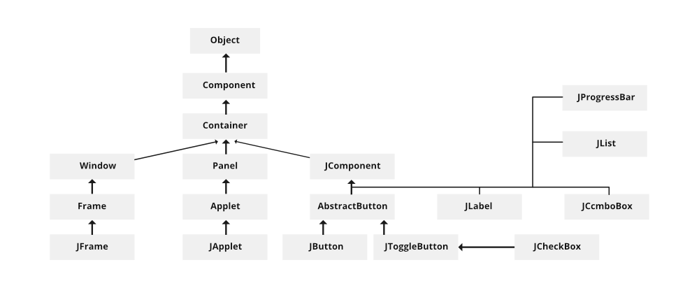

# Java UI

## Swing

**Swing** is a Java Foundation Classes (JFC) library and an extension of the Abstract Window Toolkit (AWT). Java Swing offers much-improved functionality over AWT, new components, expanded components features, and excellent event handling with drag-and-drop support.

### Introduction of Java Swing

Swing has about four times the number of User Interface (UI) components as AWT and is part of the standard Java distribution. By today's application GUI requirements, AWT is a limited implementation, not quite capable of providing the components required for developing complex GUIs required in modern commercial applications. The AWT component set has quite a few bugs and does take up a lot of system resources when compared to equivalent Swing resources. Netscape introduced its Internet Foundation Classes (IFC) library for use with Java. Its Classes became very popular with programmers creating GUI's for commercial applications.

- Swing is a Set of API (API- Set of Classes and Interfaces)
- Swing is Provided to Design Graphical User Interfaces
- Swing is an Extension library to the AWT (Abstract Window Toolkit)
- Includes New and improved Components that have been enhancing the looks and Funcionality of GUI's
- Swing can be used to build (Develop) The Standalone swing GUI Apps as Servlets and Applets
- It Employs model/view design architecture
- Swing is more portable and more flexible than AWT, the Swing is built on top of the AWT
- Swing is Entirely written in Java
- Java Swing Components are Platform-independent, and The Swing Components are lightweight
- Swing supports a Pluggable look and feel and Swing provides more powerful components such as tables, lists, Scrollpanes, Colourchooser, tabbed pane, etc
- Further Swing Follows MVC

### Difference between Java Swing and Java AWT

There are certain points from which Java Swing is different than Java AWT as mentioned below\_

| Java AWT                                                | Java Swing                                                                             |
| ------------------------------------------------------- | -------------------------------------------------------------------------------------- |
| Java AWT is an API to develop GUI applications in Java. | Swing is a part of Java Foundation Classes and is used to create various applications. |
| Components of AWT are heavy weighted.                   | The components of Java Swing are lightweight.                                          |
| Components are platform dependent.                      | Components are platform independent.                                                   |
| Execution Time is more than Swing.                      | Execution Time is less than AWT.                                                       |
| AWT components require java.awt package.                | Swing components requires javax.swing package.                                         |

### What is JFC

JFC stands for Java Foundation Classes. JFC is the set of GUI components that simplify desktop Applications. Many programmers think that JFC and Swing are one and the same thing, but that is not so. JFC contains Swing (A UI component package) and quite a number of other items:

- Cut and paste: Clipboard support
- Accessbility features: Aimed at developing GUIs for users with disabilities
- The Desktop Colors Features were first introduced in Java 1.1
- Java 2D: it has improved colors, images, and text support

### Features of Swing Class

- Pluggable look and feel
- Uses MVC architecture
- Lightweight Components
- Platform Independent
- Advanced features such as JTable, JTabbedPane, JScrollPane, ect
- Java is a platform-independent language and runs on any client machine, the GUI look and feel, owned and delivered by a platform-specific O/S, simply does not affect an application's GUI constructed using Swing components.
- **Lightweight Components**: Starting with the JDK 1.1, its AWT-supported lightweight component development. For a component to qualify as lightweight, it must not depend on any non-Java (O/s based) system classes. Swing components have their own view supported by Java's look and feel classes.
- **Pluggable Look and Feel**: This feature enables the user to switch the look and feel of Swing components without restarting the application. The Swing library provides an API that gives real flexibility in determining the look and feel of the GUI of an application.
- **Highly customizable**: Swing controls can be customized in a very easy way as visual appearance is independent of internal representation.
- **Rich controls**: Swing provides a rich set of advanced controls like Tree Tabbed Pane, slider, colorpicker, and table controls.

### Swing Classes Hierarchy



### The MVC Connection

- In general, a visual component is a composite of three distinct aspects:

  1. The way that the component looks when rendered on the screen.
  2. the way such that the component reacts to the user.
  3. The state information associated with the component.

- Over the years, one component architecture has proven itself to be exceptionally effective - **Model-View-Controller** (**MVC**).
- In MVC terminology, the model corresponds to the state information associated with the Component.
- The view determines how the component is displayed on the screen, including any aspects of the view that are affected by the current state of the model.
- The controller determines how the component reacts to the user.

The simplest Swing components have capabilities far beyond AWT components as follows:

- Swing buttons and labels can be displaying images instead of or in addition to text.
- The borders around most Swing components can be changed easily. For example, it is easy to put a 1-pixel border around the outside of a Swing label.
- Swing components do not have to be rectangular. Buttons, for example, can be round.
- Now, the latest assertive technologies such as screen readers can easily get information from Swing components.
  Example: A screen reader tool can easily capture the text that is displayed on a Swing button or label.

### Example of Java Swing Programs

#### Develop a program using label (swing) to display a message

```java
// Java program using label (swing)
// to display the message “GFG WEB Site Click”
import java.io.*;
import javax.swing.*;

// Main class
class GFG {

    // Main driver method
    public static void main(String[] args)
    {
        // Creating instance of JFrame
        JFrame frame = new JFrame();

        // Creating instance of JButton
        JButton button = new JButton(" GFG WebSite Click");

        // x axis, y axis, width, height
        button.setBounds(150, 200, 220, 50);

        // adding button in JFrame
        frame.add(button);

        // 400 width and 500 height
        frame.setSize(500, 600);

        // using no layout managers
        frame.setLayout(null);

        // making the frame visible
        frame.setVisible(true);
    }
}
```

#### Write a program to create three buttons with caption OK, SUBMIT, CANCEL

```java
// Java program to create three buttons
// with caption OK, SUBMIT, CANCEL
import java.awt.*;

class button {
    button()
    {
        Frame f = new Frame();

        // Button 1 created
        // OK button
        Button b1 = new Button("OK");
        b1.setBounds(100, 50, 50, 50);
        f.add(b1);

        // Button 2 created
        // Submit button
        Button b2 = new Button("SUBMIT");
        b2.setBounds(100, 101, 50, 50);
        f.add(b2);

        // Button 3 created
        // Cancel button
        Button b3 = new Button("CANCEL");
        b3.setBounds(100, 150, 80, 50);
        f.add(b3);

        f.setSize(500, 500);
        f.setLayout(null);
        f.setVisible(true);
    }

    public static void main(String a[]) { new button(); }
}
```

#### Program to Add Checkbox in the Frame

```java
// Java Swing Program to Add Checkbox
// in the Frame
import java.awt.*;

// Driver Class
class Lan {
    // Main Function
    Lan()
    {
        // Frame Created
        Frame f = new Frame();

        Label l1 = new Label("Select known Languages");

        l1.setBounds(100, 50, 120, 80);
        f.add(l1);

        // CheckBox created
        Checkbox c2 = new Checkbox("Hindi");
        c2.setBounds(100, 150, 50, 50);
        f.add(c2);

        // CheckBox created
        Checkbox c3 = new Checkbox("English");
        c3.setBounds(100, 200, 80, 50);
        f.add(c3);

        // CheckBox created
        Checkbox c4 = new Checkbox("marathi");
        c4.setBounds(100, 250, 80, 50);
        f.add(c4);

        f.setSize(500, 500);
        f.setLayout(null);
        f.setVisible(true);
    }

    public static void main(String ar[]) { new Lan(); }
}
```

### Components of Swing Class the task's percentage

| Class          | Description                                                                                                                                                                                                                 |
| -------------- | --------------------------------------------------------------------------------------------------------------------------------------------------------------------------------------------------------------------------- |
| Component      | A Component is the Abstract base class for about the non-menu user-interface controls of Java Swing. Components are representing an object with a graphical representation.                                                 |
| Container      | A Container is a component tha can contain Java Swing components.                                                                                                                                                           |
| JComponent     | A JComponent is a base class for all swing UI Components. In order to use a swing component that inherits from JComponent, the component must be in a containment hierarchy whose root is a top-level Java Swing container. |
| JLabel         | A JLabel is an object component for placing text in a container.                                                                                                                                                            |
| JButton        | This class creates a labeled button.                                                                                                                                                                                        |
| JColorChooser  | A JColorChooser provides a pane of controls designed to allow the user to manipulate and select a color.                                                                                                                    |
| JCheckBox      | A JCheckBox is a graphical (GUI) component that can be in either an on-(true) or off-(false) state.                                                                                                                         |
| JRadioButton   | The JRadioButton class is a graphical (GUI) component that can be in either an on-(true) or off-(false) state.                                                                                                              |
| JList          | A JList component represents the user with the scrolling list of text items.                                                                                                                                                |
| JComboBox      | A JComboBox component presents the user with a show up Menu of choices.                                                                                                                                                     |
| JTextfield     | A JTextField object is a text component that will allow for the editing of a single line of text.                                                                                                                           |
| JPasswordField | A JPasswordField object is a text component specialized for password entry.                                                                                                                                                 |
| JTextArea      | A JTextArea object is a text component that allows for the editing of multiple lines of text.                                                                                                                               |
| ImageIcon      | A ImageIcon control is an implementation of the Icon interface that paints Icons from images.                                                                                                                               |
| JScrollbar     | A JScrollbar control represents a scroll bar component in order to enable users to Select from range values.                                                                                                                |
| JOptionPane    | JOptionPane provides a set of standard dialog boxes that prompt users for a value or something.                                                                                                                             |
| JFileChooser   | A JFileChooser represents a dialog window from which the user can select a file.                                                                                                                                            |
| JProgressBar   | As the task progresses towards completion, the progress bar displays the tasks percentage on its completion.                                                                                                                |
| JSlider        | A JSlider lets the user select a value by sliding a knob within a bounded interval.                                                                                                                                         |
| JSpinner       | A JSpinner is used for selecting a number or object value from a sequence — like a stepper or number field. It typically provides a small up/down arrow control to increment or decrement the value.                        |

## WebSwing

### Introduction of WebSwing

**WebSwing** allows running desktop applications on the web, **JavaServer Faces (JSF)** offers a component-based architecture for web development, and **JSP** facilitates the creation of dynamic HTML.

### Fundamental Concepts and Architecture

#### Enabling Swing in a Browser

WebSwing functions as middleware that enables the execution of existing Java Swing applications directly in a browser, without the need for significant code modifications. It defines a new platform implementation, called "Web", for the Swing API, translating platform-specific actions into actions understandable by the browser. This functionality is supported by the HTML5 standards of modern browsers, eliminating the need for additional plugins. This approach offers a unique solution by allowing desktop applications, build with Swing technology, to be accessed and used over the internet, leveraging previous investments in software and the knowledge of development teams.

#### Key Components

The WebSwing architecture comprises some essential components. The **Swing Application** is the existing Java application intended to run in the browser, being executed on the server in its own Java Virtual Machine (JVM). It is responsible for generating rendering events, which describe what needs to be displayed in the interface, and for processing user events, such as mouse clicks and keyboard input. The **WebSwing Server** acts as an intermediary between the application and the browser. Its responsibilities include starting the Swing application, establishing WebSocket connections with the browser, receiving rendering events from the application and transferring them to the browser, as well as receiving user events from the browser and sending them to the application. The server can be implemented in various environments, such as local machines, on-premise infrastructures, in the cloud, or in containers using Docker or Kubernetes. The **Browser** is the client-side component, responsible for receiving rendering events from the server, updating the application display using HTML Canvas, and capturing user interactions, sending them as events to the server via the WebSocket connection. This architecture establishes a clear separation between the application logic, which resides in the Swing application, and the presentation layer, which is managed by the browser through the WebSwing Server.

#### Communication Mechanism

Communication between WebSwing components is carried out via the WebSocket protocol, which allows bidirectional real-time communication between the browser and the WebSwing Server. This protocol maintains a persistent connection, which is particularly suitable for Swing applications that are inherently stateful and event-driven. The flow of rendering events starts in the Swing application, which sends them to the WebSwing Server. This, in turn, forwards them to the browser via the WebSocket connection. The browser receives these events and uses them to redraw the application interface within the HTML Canvas element. When the user interacts with the application in the browser, these interactions are captured by JavaScript and sent as user events back to the WebSwing Server, also via WebSocket. The server receives these events and transmits them to the Swing application, which processes them and updates its state, potentially generating new rendering events, restarting the cycle. The choice of WebSocket ensures a responsive user experience, as interface updates and user interactions are transmitted efficiently, without the overhead of traditional HTTP request-response cycles.

#### Modernization Approaches

WebSwing offers four complementary approaches for modernizing Swing applications.

- **Web-Enable** - allows integrating basic web functionalities, such as single sign-on (SSO) and URL navigation, with minimal effort and without major code changes. It is ideal for quick improvements in the user experience of Swing applications, with a limited scope of modernization.
- **Extend** - this approach makes it possible to add native web user interfaces and powerful functionalities, such as interactive maps and advanced graphics, side by side with existing Swing components, allowing for targeted modernization without a complete rewrite and preserving business logic.
- **Facelift** - focuses on renovating the application's appearance using modern web technologies (HTML5, CSS3), with minimal changes to the backend, providing an efficient transformation of the user interface.
- **Rebuild** - this approach facilitates a gradual transition to a fully web-based application, minimizing disruption and risks associated with a complete overhaul, although requiring greater development effort.

These approaches can be combined to meet different objectives, levels of effort, and flexibility needs, making WebSwing a versatile solution for organizations with diverse needs and resources.

#### Cluster Implementation Architecture

For large-scale deployments and mission-critical systems, WebSwing offers a cluster architecture that divides the traditional WebSwing Server into separate modules. The **WebSwing Cluster Server** handles web requests, manages communication between the browser and Session Pools, and performs load balancing. It is stateless, meaning it does not store information about the user session. The configuration of this module is stored in the `webswing-server.config` file. The **WebSwing Session Pool** is responsible for starting, managing, and communicating with application instances. It connects to Cluster Servers via WebSocket and is stateful, meaning it maintains the state of the application it runs. The Session Pool configuration is done in the `webswing-app.config` and `webswing-sessionpool.properties` files, and it needs access to the application binaries. The **WebSwing Admin Console Server** provides a centralized interface for managing and monitoring the entire WebSwing cluster. In addition, WebSwing supports the use of Docker and Kubernetes for containerized deployment and auto-scaling. The cluster architecture provides scalability, redundancy, and better management for enterprise deployments of WebSwing applications, meeting the needs of high-load and critical systems.

### Basic Usage and Implementation

#### Step-by-Step Tutorials and Examples

To start using WebSwing, it is necessary to verify the prerequisites, which include having Java 8 or higher installed and a modern browser. The WebSwing server can be started by executing the `webswing.bat` (for Windows) or `webswing.sh` (for Linux) scripts. A demo application is available through the address `http:localhost:8080`, using the default credentials. to configure a custom Swing application, the Quick Start Wizard can be used, or the configuration can be done manually in the Admin Console. The steps for manual configuration include providing the application name, the classpath (which shold point to the application's JAR file), and the main class. In case of problems, it is essencial to check the `webswing.log` file. WebSwing is designed to be easy to configure and implement, allowing users to put their Swing applications on the web relatively quick and with minimal setup.

#### Configuration using the Admin Console and `webswing.config`

The WebSwing Admin Console can be accessed through the "Manage" button on the home page or by adding the `/admin` path to the base URL. The `webswing.config` file, in JSON format, stores the application settings, including path, security, theme, fonts, classpath, main class, JVM arguments, and session management. The Admin Console offers a user-friendly interface to modify these settings, avoiding manual editing of the JSON file. Through the console, it is also possible to configure security modules, such as Embedded, Property File, Database, OpenID Connect, and SAML2. WebSwing offers flexibility in configuration, allowing both graphical interface-based and file-based approaches to manage application settings, catering to different user preferences and automation needs.

#### Deployment Options

WebSwing offers several deployment options to suit different infrastructures and organizational preferences. **Standalone** deployment involves running WebSwing with its embedded Jetty server, using the provided scripts. To use an existing server, such as **Tomcat**, the `webswing-server.war` file can be deployed and configured through context parameters or system properties. WebSwing can also be run in a containerized environment using **Docker**, with a provided Dockerfile to facilitate the creation and execution of the image. For more complex and scalable deployments, especially in cloud environments, WebSwing supports **Kubernetes**, often using Docker images. Additionally, it is possible to deploy WebSwing in other Java EE application servers, such as **WebSphere**. The variety of deployment options ensures that organizations can integrate WebSwing into their existing IT infrastructure without major overhauls.

### Advantages and Disadvantages

#### Comparison with other Java Web UI Technologies

One of the main advantages of WebSwing is the absence or minimal need for changes in the existing Swing application code, in contrast to rewriting applications using native web frameworks. This results in a faster time-to-market for making applications available on the web, in addition to preserving existing business logic and reducing the risks associated with a complete rewrite. This contrasts with the effort and cost of learning new web frameworks (such as Angular, React, Vue) if a rewrite were necessary. WebSwing offers a pragmatic solution for organizations that want to extend the lifespan and reach of their desktop applications without the significant investment and disruption of a complete migration to another web technology.

#### Comparison with RDP Solutions

WebSwing differs from Remote Desktop Protocol (RDP) solutions, such as Citrix, by presenting lower licensing costs and infrastructure overhead. Furthermore, it offers more seamless integration into the web environment, compared to the remote desktop interface of RDP solutions. WebSwing also provides better integration options and customization possibilities, in addition to security advantages in its architecture. While RDP is often seen as short-term solution without without a path for modernization, WebSwing offers a migration framework. WebSwing represents a more modern, ecnonomical, and flexible alternative to traditional RDP solutions for remote access to Java desktop applications, offering a path for future modernization.

#### Benefits

WebSwing presents several benefits, including the absence of browser plugins, being compatible with all major browsers that support HTML5. It facilitates and speeds up the distribution of new application versions, offers centralized access management and enhanced security, protects the Swing application's source code, and allows controlling the Java version used to run Swing applications. In addition, it provides cross-platform accessibility, offers an embeddable JavaScript snippet for integration into existing websites, has native printing support, and provides real-time monitoring and control of user sessions through the Admin Console, including session recording and playback. WebSwing also offers built-in features for migrating to native web, independence from cloud providers, and on-premise deployment options. These benefits demonstrate WebSwing's value proposition in terms of cost savings, ease of use, security, and future-proofing of existing software investments.

#### Limitations

Despite the significant advantages, WebSwing has some limitations. Rendering the Swing interface as an HTML Canvas in the browser can generate complexity. Compared to native web applications, especially in very complex interfaces or in networks with high latency, there may be performance considerations. The "Web-Enable" or "Extend" approaches may impose restrictions on redesigning the user experience. Offline access is limited. Although initial configuration is generally simple, production may require more effort, such as creating custom scripts, user accounts, and configuring HTTPS. Test automation may be different due to Canvas-based rendering, although tools like QF-Test offer specialized support. Finally, commercial use of WebSwing requires licensing. Understanding these limitations is essential to determine if WebSwing is the appropriate solution for a specific use case and to set realistic expectations regarding performance and user experience.

## JavaServer Faces (JSF): Building Component-Based Web Interfaces

### Fundamental Concepts (JSF)

#### Component-Based Architecture

JSF builds web user interfaces using reusable UI components, such as input fields, buttons, and tables. This approach offers several benefits, including improved consistency, reduced development time, code reuse, and easier maintenance. Furthermore, JSF allows the creation of custom components, which provides event greater flexibility and extensibility in developing rich and interactive interfaces. JSF's component-based architecture promotes a structured and organized approach to UI development, facilitating the construction and maintenance of complex web applications.

#### Model-View-Controller (MVC) Pattern

JSF implements the MVC design pattern to separate presentation, data, and control logics.

- **Model** - is represented by Managed Beans (POJOs) that contain the application data and business logic.
- **View** - is composed of UI components in Facelets (XHTML) or JSP pages, responsible for displaying the model data.
- **Controller** - is the `FaceletServlet`, which handles user requests, manages the application lifecycle, and acts as an intermediary between the Model and the View.

The adoption of the MVC pattern in JSF results in better maintainability, scalability, and a clearer separation of responsibilities between different development profiles, such as UI designers and backend developers.

#### JSF Lifecycle

Request processing in JSF follows a well-defined lifecycle, composed of six-phases.

- **Restore View** - is responsible for building or restoring the component tree of the interface.
- **Apply Request Values** - processes the received request parameters and populates the component values.
- **Process Validations** - performs validation of the component values based on the defined rules.
- **Update Model Values** - the properties of the Managed Beans are updated with the validated component values.
- **Invoke Application** - invokes the application logic, such as action methods.
- **Render Response** - generates the HTML output that will be sent to the client.

It is important to note the difference between initial requests and postbacks in the lifecycle. The `FacesContext` plays a central role, storing all the necessary information for request processing. Understanding the JSF lifecycle is fundamental for developing and debugging applications built with this technology, as it dictates the order in which different parts of the application are processed in response to user interactions.

### Creating Basic Web UI Components

#### Input Fields

JSF offers the `<h:inputText>` componet to create single-line text input fields, `<h:inputSecret>` for password fields that hide the typed text, and `<h:inputTextArea>` for multi-line text input fields. These components are linked to properties of Managed Beans using the `value` attribute (e.g., `<h:inputText value="#{userBean.name}"/>`). JSF provides the standard HTML input elements as components, simplifying the creation of forms and data entry interfaces. Data binding establishes a direct link between the UI and the backend data model.

#### Buttons

To create buttons that execute actions, such as form submission, JSF offers the `<h:commandButton>` component.

The `action` attribute specifies the method to be invoked in the Managed Bean when the button is clicked. The `<h:commandLink>` component is used to create buttons in the form of hyperlinks that also trigger actions.

The `value` attribute is used to define the button label. JSF command components facilitate user interaction, triggering server-side logic in response to button clicks or link activation.

#### Tables

The `<h:dataTable>` component simplifies the display of tabular data from a collection. The `value` attribute is linked to the data collection, and `var` specifies the variable that represents each row of the table. The table columns are defined using the `<h:column>` component, and column headers can be specified with `<f:facet name="header">`. The data for each cell is accessed using EL expressions (e.g., `#{student.name}`).
The `<h:dataTable>` component automates the logic of iterating and displaying data in table format based on the provided collection.

#### Handling User Interactions

The `actionListener` attribute of command components allow invoking methods in Managed Beans in response to action events (e.g., button clicks). Similarly, the `valueChangeListener` attribute of input components triggers methods when the component's value is changed. These event handling mechanisms occur in specific phases of the JSF lifecycle. JSF offers a structured event handling mechanism that allows developers to easily respond to user interactions and update the application state.

#### Data Binding

A fundamental feature of JSF is the use of Expression Language (EL) to link the UI component attributes, especially the `value` attribute, to properties in Managed Beans. JSF automatically manages the transfer of data between the UI and the model (Managed Beans) during the lifecycle phases. Managed Beans can have different scopes (e.g., request, session, application, view), which affects the behavior of data binding. Data binding simplifies development by automatically synchronizing the UI with the application data, reducing the need for boilerplate code to handle form submission and data display.

## JavaServer Pages (JSP): Embedding Java in HTML

### Fundamental Concepts (JSP)

#### Syntax for Embedding Java Code

JSP allows embedding Java code directly into HTML pages through specific script elements.

- **Scriplets** (`<%... %>`) - are used to include Java instructions.
- **Expressions** (`<%=... %>`) - evaluate a Java expression and insert its value directly into the HTML output.
- **Directives** (`<%@... %>`) - provide instructions to the JSP container, such as importing classes (`page import`), including other files (`include`), and using tag libraries (`taglib`).
- **Declarations** (`<%!... %>`) - allow declaring variables and methods at the level of the generated servlet class.
- **Comments** (`<%--... --%>`) - are used to add JSP-specific comments.

This syntax offers a direct way to add dynamic content to web pages.

#### JSP Lifecycle

JSP pages follow a specific lifecycle. Initially, the JSP page goes through the **Translation** phase, where the JSP file is converted into Java servlet source code. Then, the **Compilation** phase occurs, where the servlet source code is compiled to generate a class file. The web container then performs **Class Loading** of the servlet class into memory and **Instantiation** of an object of that class. Before processing requests, the container calls the `jspInit()` method during the **Initialization** phase (which occurs only once). For each client request, the `_jspService()` method is invoked in the **Request Processing** phase. Finally, when the JSP page is no longer needed, the `jspDestroy()` method is called during the **Destruction** phase (also occuring only once). It is fundamental to understand that a JSP page is, in essence, converted into a servlet.

#### Implicit Objects

In each JSP page, several objects are available implicitly, without the need for explicit declaration. The `request` object (of the `HttpServletRequest` class) provides access to request information, such as parameters and headers. The `response` object (of the `HttpServletResponse` class) is used to send responses to the client, allowing setting headers and cookies. The `out` object (of the `JspWriter` class) facilitates writing content to the response. The `session` object (of the `HttpSession` class) represents the user session. The `application` object (of the `ServletContext` class) represents the web application context. The `config` object (of the `ServletConfig` class) offers access to servlet configuration information. The `page` object (of the `Object` class) represents the current JSP page instance (synonymous with `this`). The `pagecontext` object (of the `PageContext` class) provides access to various attributes in different scopes and information related to the page. Finally, the `exception` object (of the `Throwable` class) is available only in error pages and provides information about the occurred exception. These implicit objects simplify access to common web application resources.

### Creating Dynamic Web Pages

#### Examples of Dynamic Content

JSP allows generating dynamic content in various ways, It is possible to display the current date and time, retrieve and show request parameters, such as those submitted by forms, access session or application attributes, and include dynamic content based on conditions. This ability to generate content that changes based on various factors make JSP a powerful tool for creating interactive and personalized web applications.

#### Interaction with Java Servlets

JSP pages can interact with Java servlets in several ways. It is possible to invoke servlets from JSPs using the `<jsp:include>` and `<jsp:forward>` actions, as well as pass parameters between them with the `<jsp:param>` action. Servlets can also forward requests to JSP pages using the `RequestDispatcher`. This interaction is fundamental in the Model 2 architecture, where servlets generally handle business logic and JSPs handle data presentation. This collaboration between servlets and JSPs promotes a better separation of responsibilities in web application development.

#### Form Handling and Data Display

Creating HTML forms in JSP is straightforward. Data submitted through these forms can be easily retrieved using the `request.getParameter()` method. This retrieved data can then be displayed dynamically on the JSP page using expressions. JSP also supports handling different types of form elements, such as text fields, checkboxes, and radio buttons. This ability to handle user input and display data dynamically makes JSP suitable for creating interactive web applications.
